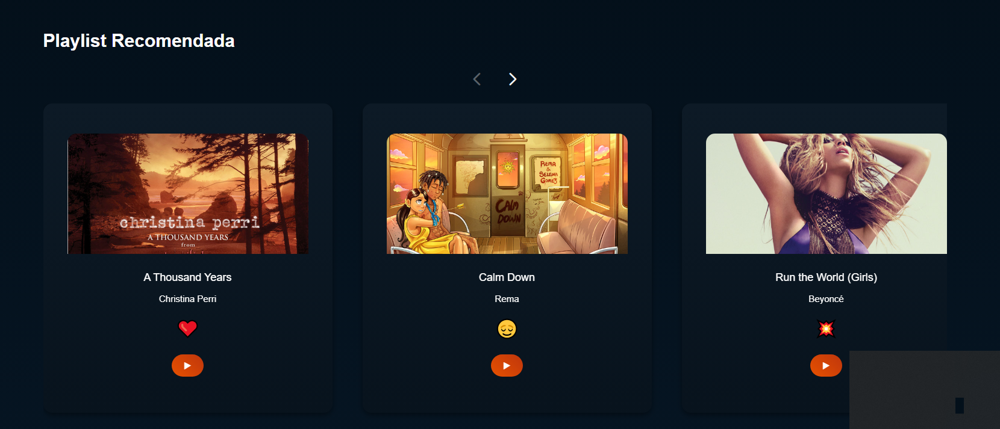
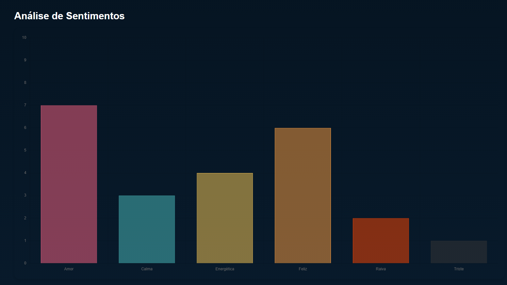

# 📚🎵 Book Sound Track

Bem-vindo ao **Book Sound Track**! Este projeto combina a magia dos livros com a energia da música, criando playlists personalizadas com base no sentimento e na atmosfera de um livro. Usando APIs do Google Books, Spotify e Google Generative AI, o programa analisa a descrição de um livro, identifica os sentimentos predominantes e sugere músicas que refletem essas emoções.

## ✨ Funcionalidades

- **Análise de Sentimentos**: O programa analisa a descrição de um livro e identifica sentimentos como Amor, Calma, Energia, Felicidade, Raiva e Tristeza.

*- **Playlist Personalizada**: Com base nos sentimentos identificados, o programa gera uma playlist de 6 músicas que combinam com o clima do livro.

- Integração com APIs:
   
   - **Google Books API**: Para obter a descrição e detalhes do livro.

   - **Google Generative AI**: Para análise de sentimentos e geração de playlists.
     
   - **Spotify API**: Para buscar músicas e informações sobre as faixas.

- **Interface Simples**: Uma aplicação Flask que permite inserir o título de um livro e receber a playlist correspondente.

## 🛠️ Como Configurar

### Pré-requisitos

- Python 3.8 ou superior.

- Contas de desenvolvedor nas seguintes plataformas:
  
  - Google Cloud (para Google Books API e Google Generative AI).

  - Spotify for Developers (para Spotify API).

### Passos para Configuração

1. Clone o repositório:

```bash
git clone https://github.com/michelleGomes85/StorySoundTrack.git
cd StorySoundTrack
```

2. Instale as dependências:

```bash
pip install -r requirements.txt
```

3. Configure as variáveis de ambiente:
  - Crie um arquivo **.env** na raiz do projeto e adicione as seguintes chaves de API:

  ```bash
    GOOGLE_API_KEY=sua_chave_google_api
    GOOGLE_BOOKS_API_KEY=sua_chave_google_books_api
    SPOTIPY_CLIENT_ID=seu_client_id_spotify
    SPOTIPY_CLIENT_SECRET=seu_client_secret_spotify
  ```
4. Execute a aplicação:

```bash
python app.py
```

5. Acesse a aplicação:

  - Abra o navegador e acesse: 

  ```bash 
  http://localhost:5000
  ```

## 🎯 Como Usar

1. Na página inicial, insira o título de um livro no campo de busca.

2. Clique em "Gerar Playlist".

3. Aguarde enquanto o programa analisa o livro e gera a playlist.

4. Na página de resultados, você verá:

  - A descrição do livro.

  - Uma análise dos sentimentos predominantes.

  - Uma playlist de 6 músicas, cada uma com um link para o Spotify.

## 🖼️ Exemplos de Uso

### Página Inicial


### Página Resposta

**Descrição Livro**


**Playlist**



**Analise de Sentimentos**



## 🔑 Onde Obter as APIs

### Google Books API

  1. Acesse o [Google Cloud Console.](https://console.cloud.google.com/welcome?project=meuprojetolivros)
  
  2. Crie um novo projeto ou use um existente.

  3. Ative a Google Books API.

  4. Gere uma chave de API e adicione-a ao arquivo .env.

### Spotify API

  1. Acesse o [Spotify for Developers](https://developer.spotify.com/).

  2. Crie uma nova aplicação.

  3. Obtenha o Client ID e Client Secret.

  4.Adicione-os ao arquivo .env.

### Google Generative AI

  1. Acesse o [Google AI Studio](https://aistudio.google.com/prompts/new_chat).

  2. Crie uma chave de API para o modelo Gemini.

  3. Adicione a chave ao arquivo .env.

🛠️ Estrutura do Projeto

 ```sh
StorySoundTrack/
├── assets
├── config/
│   └── config.py
├── services/
│   └── ai_service.py
│   ├── book_service.py
│   ├── spotify_service.py
├── static/
│   ├── css/
│   │   └── styles_result.css
│   │   └── styles.css
│   ├── js/
│   │   └── script_index.js
│   │   └── script_result.js
│   └── images/
│       ├── fav.png
│       ├── gemini-icon.png
│       ├── google-books-icon.png
│       ├── image_home.png
│       ├── logo.png
│       ├── spotify-icon.png
├── templates/
│   ├── index.html
│   └── result.html
├── utils/
│   └── helpers.py
├── app.py
├── requirements.txt
└── README.md
```

## 📬 Autores

[](https://github.com/michelleGomes85)
